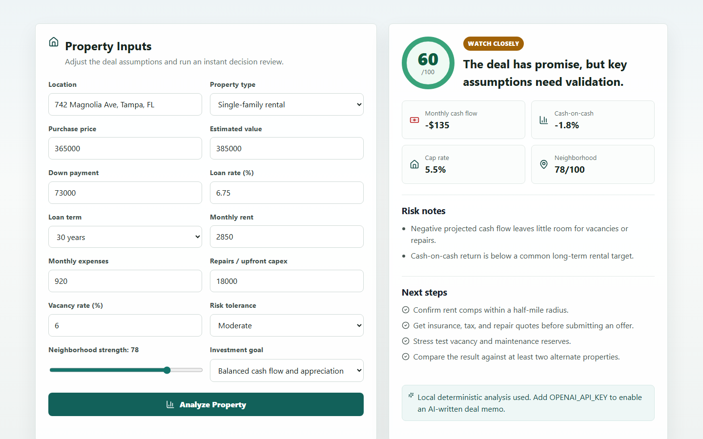

# AI Property Decision Assistant

## Overview

AI Property Decision Assistant is a full-stack property underwriting tool that helps real estate investors decide whether a deal deserves more diligence. The app combines a React + Vite client with a Node + Express API that produces deterministic deal analysis by default and can optionally add an AI-written note when an OpenAI API key is configured.

This tool is for early investment screening. It is not financial, legal, tax, or lending advice. Always validate assumptions with licensed professionals and current market data before making an offer.

## Features

- Property input workflow for price, estimated value, rent, expenses, financing, repairs, vacancy, neighborhood strength, risk tolerance, and investment goal.
- Decision score with Strong Buy, Watch Closely, or Pass guidance.
- Cash flow, cap rate, cash-on-cash return, mortgage estimate, risk notes, and next steps.
- Server-side validation rejects unsafe or impossible deal assumptions with a clear 400 response.
- Friendly local development port fallback from `5000` to `5001`, `5002`, and `5003`.
- Optional OpenAI enhancement without making the app dependent on paid credentials.

## Architecture

```text
ai-property-decision-assistant/
|-- client/              # React + Vite frontend
|   |-- src/
|   |   |-- App.jsx      # Main underwriting UI
|   |   `-- styles.css   # Responsive app styling
|   `-- vite.config.js   # Dev server and API proxy config
|-- server/              # Node + Express backend
|   |-- controllers/     # Request handlers
|   |-- routes/          # API route definitions
|   |-- services/        # Deal scoring, validation, optional AI note
|   `-- server.js        # Express app startup and port fallback
|-- screenshots/         # Screenshot placeholders
|-- .env.example         # Local environment variable template
`-- README.md
```

The frontend submits property assumptions to the Express API. The backend validates the request, calculates deal metrics, returns a recommendation, and adds an optional AI memo only when `OPENAI_API_KEY` is configured.

Production uses split hosting:

- `npm start` starts the backend API only.
- The frontend should be built with `npm run build` and hosted separately from `client/dist`.
- The API should be deployed separately as a Node service running the Express server in `server/`.
- Configure the frontend host to send API requests to the deployed Node API URL.

## Installation

Requirements:

- Node.js 18 or newer
- npm

Install dependencies:

```bash
npm install
npm run install:all
```

Optional environment setup:

```bash
cp .env.example server/.env
```

Example environment values:

```bash
PORT=5000
CLIENT_ORIGIN=http://localhost:5173
OPENAI_API_KEY=
OPENAI_MODEL=gpt-4.1-mini
```

The app works without `OPENAI_API_KEY`; the server returns local deterministic analysis plus a note explaining that AI enhancement is disabled.

## Usage

Start the full local development app:

```bash
npm run dev
```

The client runs at `http://localhost:5173` and proxies API calls to `http://localhost:5000`.

During local development, the API starts on port `5000` by default. If port `5000` is already in use, the server prints a friendly warning and automatically tries `5001`, then `5002`, then `5003`. If all fallback ports are busy, it exits with a clear message so you can stop another server or set `PORT` to an open port. The client tries the normal proxied API route first, then the same local fallback API ports.

Useful scripts:

```bash
npm run dev        # server and client together
npm run build      # build the React client
npm run start      # start the Express API only
npm run test       # run server unit tests
```

API endpoints:

- `GET /api/health` returns service status.
- `POST /api/analyze-property` returns score, recommendation, metrics, risks, next steps, and optional AI note.

Example analysis request:

```json
{
  "address": "742 Magnolia Ave, Tampa, FL",
  "propertyType": "Single-family rental",
  "purchasePrice": 365000,
  "estimatedValue": 385000,
  "downPayment": 73000,
  "interestRate": 6.75,
  "loanTermYears": 30,
  "monthlyRent": 2850,
  "monthlyExpenses": 920,
  "repairCost": 18000,
  "vacancyRate": 6,
  "neighborhoodScore": 78,
  "riskTolerance": "Moderate",
  "goal": "Balanced cash flow and appreciation"
}
```

Numeric deal inputs are validated before analysis. Invalid, missing, `NaN`, `Infinity`, negative, out-of-range, or impossible values return a clear `400` response instead of producing unsafe metrics.

## Screenshot Section

### Home and Property Inputs

<p>
  
</p>

### Completed Analysis Results

<p>
  
</p>

Screenshots are stored in the `screenshots/` folder.

```text
screenshots/
|-- app-home.png       # main app screen
`-- results-view.png   # analyzed property result
```

## Future Improvements

- Save property analyses to a database.
- Add user accounts and saved deal history.
- Add downloadable PDF investment summaries.
- Compare multiple properties side by side.
- Add charts for cash flow, equity, and return projections.
- Add configurable underwriting assumptions by investment strategy.

## J Capital Inspiration Section

This project is inspired by the idea of a J Capital-style property decision system: a simple operating tool that helps organize real estate deal inputs, reduce guesswork, and turn property analysis into a repeatable workflow. The goal is to support faster first-pass decisions while still reminding users to verify numbers before making real investment choices.

## Author

Olabode Moses Jimoh

